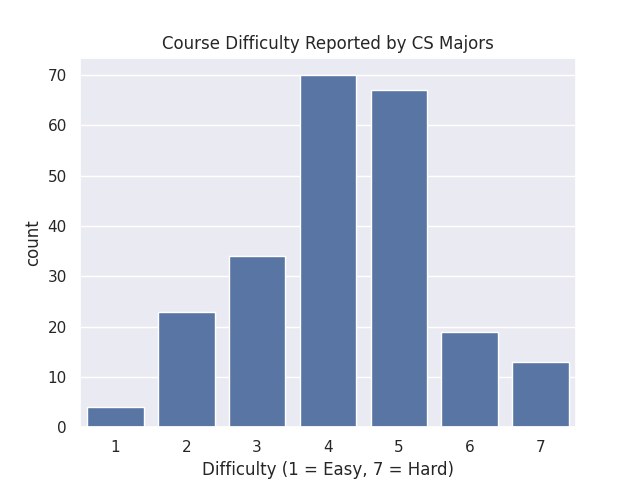
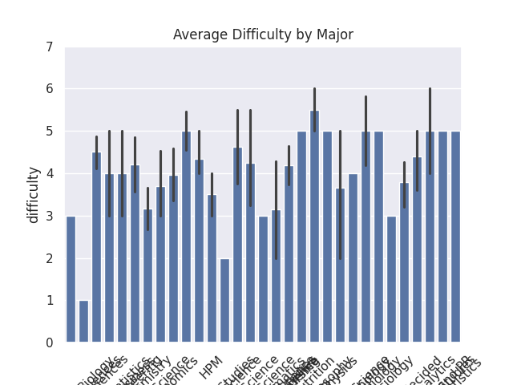
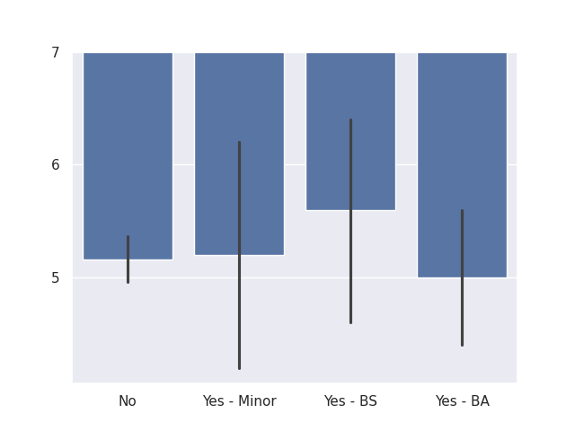

---
# Do not edit the text between these lines!
layout: default
---

# Welcome to my COMP110 Website!

## About Me

Hi, my name is Esme Park! I am a first-year student at UNC Chapel Hill. I am interested in neuroscience, economics, medicine, and understanding how data can reveal patterns in student experiences.

## Research Question

Do computer science majors report lower perceived difficulty in COMP110 compared to non-CS majors?

## Data Used

In this analysis, I will compare responses from computer science majors and non-computer science majors to determine whether their experiences in the course differ. If computer science majors respond differently on measures such as difficulty, value, and interest, this could support the idea that their feedback should be given special consideration when improving the course.

## Analysis and Findings

From my analysis, I found that most computer science majors reported COMP110 as moderately difficult, with many responses falling around 4 or 5 on a 1–7 difficulty scale. This suggests that even students already interested in computer science did not necessarily view the class as extremely easy.

When comparing average difficulty across majors, the results were harder to interpret because there were many different majors represented. Some majors had very small sample sizes, which may make their averages less reliable. However, the graph still shows that reported difficulty varies by academic background.

The clearest comparison came from grouping students by computer science status. Students pursuing a CS B.S. reported slightly higher difficulty on average than some other groups, while CS B.A., CS minor, and non-CS students also reported difficulty in the upper-middle range. Overall, the data suggests that COMP110 is perceived as moderately challenging across groups, not only by non-CS students.

## CS Major/Minor Distribution

## Average Difficulty by Major

## Difficulty by Computer Science Status

## Conclusion

From my analysis, COMP110 is a moderately difficult course for many students, including those pursuing computer science. Since no group consistently reports the course as easy, additional beginner-friendly support resources could help improve student understanding and success.